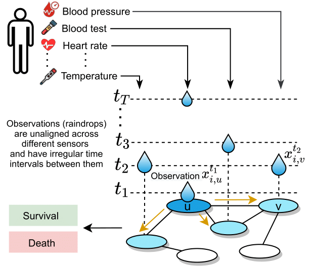
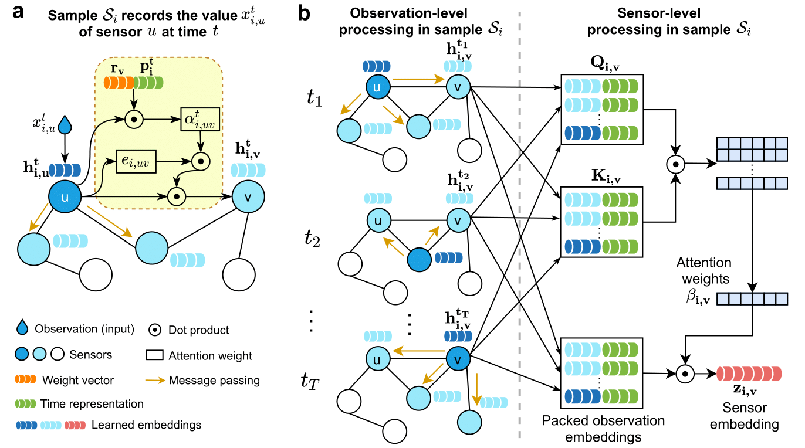

# Graph-Guided Network For Irregularly Sampled Multivariate Time Series

#### Authors: [Xiang Zhang](http://xiangzhang.info/) (xiang_zhang@hms.harvard.edu), [Marko Zeman](https://github.com/mims-harvard/Raindrop)(marko.zeman@fri.uni-lj.si), <br/>
####  [Theodoros Tsiligkaridis](https://github.com/mims-harvard/Raindrop)(ttsili@ll.mit.edu), [Marinka Zitnik](https://zitniklab.hms.harvard.edu/) (marinka@hms.harvard.edu)

#### [Project website](https://zitniklab.hms.harvard.edu/projects/Raindrop)

## Overview

This repository contains processed datasets and implementation code for manuscript *Graph-Guided Network For Irregularly Sampled Multivariate Time Series*.
We propose, Raindrop, a graph-guided neural network, to learn representations of irregularly sampled multivariate time series. 
We evaluate Raindrop on three healthcare and human activity datasets in four challenging settings (three in Section 4.1 and one in Appendix of the paper) including a leave-sensor-out setup. 
Please see our paper ([arxiv](https://arxiv.org/pdf/2110.05357.pdf), [ICLR'22](https://openreview.net/forum?id=Kwm8I7dU-l5)) for more details. 


## Key idea of Raindrop

The proposed Raindrop models dependencies between sensors using neural message passing and temporal self attention.
Raindrop represents every sample (e.g., patient) as a graph, where nodes indicate sensors and edges represent dependencies between them. 
Raindrop takes samples as input, each sample containing multiple sensors and each sensor consisting of irregularly recorded observations (e.g., in clinical data, an individual patient’s state of health, recorded at irregular time intervals with different subsets of sensors observed at different times). Raindrop model is inspired by the idea of raindrops falling into a pool at sequential but nonuniform time intervals and thereby creating ripple effects that propagate across the pool (as shown in the following figure).

<!-- ![Raindrop idea] -->
<!-- (images/fig1.png "Idea of Raindrop.") -->
<p align="center">
    
</p>

The main idea of Raindrop is to generate observation embeddings (a) and sensor embeddings (b). Calculated sensor
embeddings then serve as the basis for sample embeddings that can fed into a downstream task 
such as classification. 



**(a)** Raindrop generates observation embedding based on observed value, passes message to neighbor sensors, and generates observation embedding through inter-sensor dependencies. 
**(b)** An illustration of generating sensor embedding. We apply the message
passing in (a) to all timestamps and produce corresponding observation embeddings. 
We aggregate arbitrary number of observation embeddings into a fixed-length sensor embedding,
while paying distinctive attentions to different observations. We independently apply the sensor-level processing procedure to all sensors.
**(c)** Raindrop updates edge weight based on pervious layer's edge weightand the learned inter-sensor attention weights in all time steps. We explicitly show layer index *l* as multiple layers are involved.


## Experimental settings

We evaluate our model in comparison with the baselines in four different settings:

**Setting 1: Classic time series classification.** We randomly split the dataset into training
(80%), validation (10%), and test (10%) set. The indices of these splits are fixed across all methods.

**Setting 2: Leave-fixed-sensors-out.** In this setting, we select a proportion of
sensors, and set all their observations as zero in validation and test set 
(training samples are not changed). We mask out the most informative sensors and 
the selected sensors are fixed across samples and models. The missed sensors are the same across all samples. This setting is practically meaningful, such as facing sensor failure, or some sensors are unavailablein specific scenes. Our intuition is that Raindrop can compensate for the missing information from nearby observations by exploiting relational dependencies.

**Setting 3: Leave-random-sensors-out.** Setting 3 is similar to Setting 2 except that the
missing sensors in this setting are randomly selected instead of fixed. In each test sample, 
we randomly select a subset of sensors and regard them as missing through replacing all of their 
observations with zeros. The selected sensors are different across samples.

**Setting 4: Group-wise time series classification.** In this setting we split the data 
into two groups, based on a specific static attribute. The first split attribute is *age*, 
where we classify people into young (< 65 years) and old (>= 65 years) groups. 
We also split patients into male and female by *gender* attribute. Given the split attribute, 
we use one group as a train set and randomly split the other group into equally sized
validation and test set.

## Datasets

We prepared to run our code for Raindrop as well as the baseline methods with two healthcare and 
one human activity dataset.

### Raw data

**(1)** P19 (PhysioNet Sepsis Early Prediction Challenge 2019) includes 38,803 patients that are monitored by 34 sensors. The original dataset has 40,336 patients, we remove the samples with too short or too long time series, remaining 38,803 patients (the longest time series of the patienthas more than one and less than 60 observations).  Each patient is associated with a static vector indicating attributes: age, gender, time between hospital admission and ICU admission, ICU type, and ICU length of stay (days).  Each patient has a binary label representing occurrence of sepsis within the next 6 hours. The dataset is highly imbalanced with only∼4% positive samples. Raw data of **P19** can be found at https://physionet.org/content/challenge-2019/1.0.0/

**(2)** P12 (PhysioNet Mortality Prediction Challenge 2012) includes 11,988 patients (samples), after removing 12 inappropriate samples as they do not contain any time series information. The 12 patients' id are: 140501, 150649, 140936, 143656, 141264, 145611, 142998, 147514, 142731,150309, 155655, and 156254. Each patient contains multivariate time series with 36 sensors (excluding weight), which are collected in the first 48-hour stay in ICU. Each sample has a static vector with 9 elements including age, gender, etc. Each patient is associated with a binary label indicating length of stay in ICU, where negative label means hospitalization is not longer than 3 days and positive label marks hospitalization is longer than 3 days. P12 is imbalanced with∼93% positive samples. Raw data of **P12** can be found at https://physionet.org/content/challenge-2012/1.0.0/

<!-- records temporal measurements of 36 sensors of 11,988 patients in the first 48-hour stay in ICU. The samples are labeled based on hospitalization length.  -->
 

**(3)** PAM (PAMAP2 Physical Activity Monitoring) measures daily living activities of 9 subjects with 3 inertial measurement units.  We modify it to suit our scenario of irregular time series classification.  We excluded the ninth subject due to short length of sensor readouts. We segment the continuous signals into samples with the time window of 600 and the overlapping rate of 50%.  PAM originally has 18 activities of daily life.  We exclude the ones associated with less than 500 samples, remaining 8 activities. After modification, PAM dataset contains 5,333 segments (samples) of sensory signals.  Each sample is measured by 17 sensors and contains 600 continuous observations with the sampling frequency 100 Hz.  To make time series irregular, we randomly remove 60% of observations. To keep fair comparison, the removed observations are randomly selected but kept the same for all experimental settings and approaches. PAM is labelled by 8 classes where each class represents an activity of daily living. PAM does not include static attributes and the samples are approximately balanced across all 8 categories. Raw data of **PAM** can be found at http://archive.ics.uci.edu/ml/datasets/pamap2+physical+activity+monitoring

<!-- The preprocessing scripts with data are available in folders *P19data*, *P12data* and *PAMdata*.  -->

### Processed data
Download the processed datasets:

**(1)** P19 (PhysioNet Sepsis Early Prediction Challenge 2019) https://doi.org/10.6084/m9.figshare.19514338.v1

**(2)** P12 (PhysioNet Mortality Prediction Challenge 2012) https://doi.org/10.6084/m9.figshare.19514341.v1

**(3)** PAM (PAMAP2 Physical Activity Monitoring) https://doi.org/10.6084/m9.figshare.19514347.v1

We organize the well-processed and ready-ro-run data in the same way for three datasets. Next we introduce the files, taking *P12data* folder as an example.
<!-- Let's look at the content of *P12data* folder, though, the structure is the same for all three folders with data.  -->
<!-- Some datasets may exclude raw data and do not have preprocessing scripts. -->
Inside the *P12data* folder, we have the following structure:

- *process_scripts*
    - Inside we have preprocessing scripts and *readme* with the instructions how to run them.
- *processed_data*
    - *P\_list.npy*: Array of dictionaries, which is created from raw data. Array has a length of 
    number of samples and each dictionary has keys 'id', 'static' variables and 'ts' time series data.
    - *PTdict\_list.npy*: Processed array of dictionaries. Array has a length of number of samples and 
    each dictionary includes keys, such as 'id', 'static' attributes, 'arr' time series data 
    and 'time' of observations.    
    - *arr\_outcomes.npy*: The content has the shape (number of samples, outcomes). 
    For each sample (patient) there are target outputs, such as length of hospital stay or mortality.
    - *ts\_params.npy*: Array with names of all sensors.
    - *static\_params.npy*: Array with names of static attributes.
    - *extended\_static\_params.npy*: Array with names of extended static attributes 
    (with more attributes than in *static\_params.npy*).
    - *readme.md*: Short description of the files. Readme and preprocessing scripts may be ignored if the dataset is obviously easy to understand.
- *rawdata*
    - *set-a*: Data in the form of 4,000 .txt files, each containing time series observations. 
    - *set-b*: Data in the form of 4,000 .txt files, each containing time series observations.
    - *set-c*: Data in the form of 4,000 .txt files, each containing time series observations.
    - *Outcomes-a*: Text file, including target values (e.g., length of hospital stay, mortality) for all 4,000 samples from *set-a*.
    - *Outcomes-b*: Text file, including target values (e.g., length of hospital stay, mortality) for all 4,000 samples from *set-b*.
    - *Outcomes-c*: Text file, including target values (e.g., length of hospital stay, mortality) for all 4,000 samples from *set-c*.
- *splits*
    - Includes 5 different splits of data indices (train, validation, test) to use them when running an algorithm five times to measure mean and standard deviation of the performance.


## Requirements

Raindrop has tested using Python 3.6 and 3.9.

To have consistent libraries and their versions, you can install needed dependencies 
for this project running the following command:

```
pip install -r requirements.txt
```


## Running the code

We provide ready-to-run code for our Raindrop model and the following baselines: 
Transformer, Trans-mean, GRU-D, SeFT and mTAND. See details of these baselines in our paper. 
Starting from root directory *Raindrop*, you can run models as follows:

- Raindrop
```
cd code
python Raindrop.py
```

- Transformer
```
cd code/baselines
python Transformer_baseline.py
```

- Trans-mean
```
cd code/baselines
python Transformer_baseline.py --imputation mean
```

- GRU-D
```
cd code/baselines
python GRU-D_baseline.py
```

- SeFT
```
cd code/baselines
python SEFT_baseline.py
```

- mTAND
```
cd code/baselines/mTAND
python mTAND_baseline.py
```

- IP-Net
```
cd code/baselines/IP_Net/src
python IP_Net_baseline.py
```

- MTGNN
```
cd code/baselines
python MTGNN_baseline.py
```

- DGM2-O
```
cd code/baselines
python DGM2_baseline.py
```

Algorithms can be run with named arguments, which allow the use of different settings from the paper:
- *dataset*: Choose which dataset to use. Options: [P12, P19, PAM].
- *withmissingratio*: If True, missing ratio of sensors in test set ranges from 0.1 to 0.5. 
If False, missing ratio is 0. Used in setting 2 and 3. Options: [True, False].
- *splittype*: Choose how the data is split into train, validation and test set.
Used in setting 4. Options: [random, age, gender]. 
- *reverse*: Choose the order in setting 4. If True, use female/old for training. 
If False, use male/young for training. Options: [True, False].
- *feature_removal_level*: Choose between setting 1 (no_removal), 2 (set) and 3 (sample). 
Options: [no_removal, set, sample]. 
<!-- - *predictive_label*: Choose which label is predicted. Only for P12 dataset. Options: [mortality, LoS]. -->
- *imputation*: Imputation method to choose to fill in missing values. Only used in Transformer.
Options: [no_imputation, mean, forward, cubic_spline].


#### Examples

In all cases beware the directory from which you run these commands (see *cd* commands above).

Run Raindrop model on P19 dataset in setting 1 (standard time series classification):

```
python Raindrop.py --dataset P19 --withmissingratio False --splittype random --feature_removal_level no_removal 
```

Run Transformer baseline on PAM dataset in setting 2 (leave-fixed-sensors-out):

```
python Transformer_baseline.py --dataset PAM --withmissingratio True --splittype random --feature_removal_level set
```

Run SeFT baseline on PAM dataset in setting 3 (leave-random-sensors-out):

```
python SEFT_baseline.py --dataset PAM --withmissingratio True --splittype random --feature_removal_level sample
```

Run GRU-D baseline on P19 dataset in setting 4, where you train on younger than 65 and 
test on aged 65 or more.

```
python GRU-D_baseline.py --dataset P19 --withmissingratio False --splittype age --feature_removal_level no_removal --reverse False
```
<!-- ### Large size data files
Due to size limitation in GitHub, the following large data files are not uploaded to this repository yet. We will store these large size data into an accessable platform (such as *figshare*) and share the download link here soon. 
- code/baselines/mTAND/P_list.npy
- code/baselines/saved/dataset.npy
- code/baselines/saved/inputs.npy
- code/baselines/saved/P19_dataset.npy
- code/baselines/saved/P19_inputs.npy
- code/baselines/saved/PAM_dataset.npy
- code/baselines/saved/PAM_inputs.npy
- code/baselines/saved/PAM_sparse_mask.npy
- P12data/processed_data/P_list.npy
- P12data/processed_data/PTdict_list.npy
- P19data/processed_data/PT_dict_list_6.npy
- PAMdata/processed_data/AR_8p_8c.mat
- PAMdata/processed_data/PTdict_list.npy -->


## Citing

If you find *Raindrop* useful for your research, please consider citing this paper:
```
@inproceedings{zhang2021graph,
Title = {Graph-Guided Network For Irregularly Sampled Multivariate Time Series},
author = {Zhang, Xiang and Zeman, Marko and Tsiligkaridis, Theodoros and Zitnik, Marinka},
booktitle = {International Conference on Learning Representations, ICLR},
year      = {2022}
}
```

## Miscellaneous

Please send any questions you might have about the code and/or the algorithm to <xiang.zhang@uncc.edu>.

## License

Raindrop is licensed under the MIT License.
